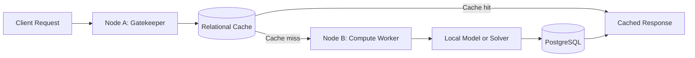

# Cognitive Caching

**Local-first cognitive caching and distributed AI orchestration prototype**

Cognitive Caching is an experimental local-first system designed to intercept AI and computational requests before expensive execution. It explores whether structured request representations, closed-interval relational matching and distributed node selection can reduce repeated computation while preserving an observable and auditable execution path.

Cognitive Caching is currently an MVP (Minimum Viable Product) and research-oriented prototype. Its theoretical model is inspired by non-local interactions in peridynamics and by decentralized swarm systems, but the software should not be interpreted as a complete peridynamic solver or as a universally validated cognitive caching system.

---

## Strategic Objective & Research Status

This repository serves as a **private-source visual prototype** and concept preview. The primary objective of this public-facing component is to introduce the architectural foundations of Cognitive Caching to **universities, research institutions, and technical investors** to accelerate formal empirical testing, validation, and early-stage startup formation. 

The core algorithmic logic, internal mechanics, and critical production components remain proprietary and are excluded from this public preview repository. 

---

## Research Objectives

To transition this research prototype into a validated framework, the project seeks collaborative opportunities and validation partners across specific academic and empirical domains:

* **Formal Complexity Validation:** Analyzing sub-linear relational lookup performance under strict B-Tree range search conditions against traditional high-dimensionality vector database approaches.
* **Mathematical Optimization of Relational Intervals:** Developing advanced bounding techniques for parameter matching to guarantee cache integrity without exhaustive multi-dimensional calculations.
* **Swarm and Network Resilience Testing:** Modeling decentralized network conditions to optimize asynchronous request routing across distributed nodes under uneven computational workloads.
* **Empirical Workload Benchmarking:** Establishing standardized evaluation frameworks across various scientific and generative AI workloads to measure net latency reductions and structural constraints.

---

## Features

### Current MVP capabilities
* **Gatekeeper / Request Interception Layer:** Intercepts computational queries before execution to evaluate potential matches.
* **Cache Lookup & Hit/Miss Tracking:** Evaluates query structures to track and log hits and misses.
* **PostgreSQL Persistence:** Utilizes a relational database structure to persist request metadata and cached computational states.

### Experimental capabilities
* **Closed-Interval Relational Matching:** Explores structured feature representations and configured relational intervals rather than heavy multi-dimensional vector database dependencies.
* **Feature-Vector Based Request Comparison:** Evaluates multi-parameter structures with configurable mathematical thresholds.
* **Local-First Node Orchestration:** Relies on local interaction horizons to model decentralized traffic across local node segments.

### Planned capabilities (Startup Roadmap)
* Scientific solver integration and academic validation pipelines.
* Domain-specific optimization models.
* Distributed compute workers and decentralized swarm architectures.
* Standardized, reproducible benchmarks under intensive workloads.
* Model versioning and robust cryptographic cache invalidation.

---

## Architecture

* **Node A (Gatekeeper):** A lightweight decision and persistence layer responsible for filtering and routing incoming requests.
* **Relational Cache:** The result-reuse layer utilizing strict interval limits to skip redundant execution.
* **Node B (Compute Worker):** The resource-intensive computation layer executing models or scientific solvers.
* **PostgreSQL:** The persistence engine storing state, execution logs, and relational metadata.

---

## Core Idea

1. Receive a computational request.
2. Normalize or extract relevant structured features.
3. Look up previously stored results using closed-interval relational matching.
4. Return a cached response when the configured matching policy accepts the result within given tolerances.
5. Forward a cache miss to a local model, solver, or compute worker.
6. Store the new result along with its associated metadata.
7. Record execution latency, status, and node routing information.

> **Important Limitation:** A cache hit is not automatically a semantic equivalence proof. The validity of a reused result depends heavily on the specific domain, feature representation, tolerance parameters, model version, data version, and validation policy.

---

## CIRA Model

Cognitive Caching utilizes the **Closed-Interval Relational Architecture (CIRA)**. Within this project, CIRA serves as a working name for an experimental matching and orchestration strategy based on structured feature representations and configured relational intervals.

The current implementation explores sub-linear relational lookup under specific indexing, data-distribution, and dimensionality assumptions. Formal complexity claims remain subject to benchmark and rigorous workload validation.

In the current research direction, peridynamic parameters are used as a domain-inspired feature space for experimentation. They are not, by themselves, a complete physical simulation.

---

## Peridynamics and Swarm Inspiration

Cognitive Caching takes inspiration from peridynamics—a non-local formulation of continuum mechanics—and from decentralized swarm systems. In the software architecture, these ideas are reinterpreted as local interaction horizons, structured neighbourhoods, node affinity, and adaptive workload distribution.

This is an architectural and research analogy under development. The current MVP does not claim to implement the full equations, constitutive models, or numerical validation pipeline of a peridynamic mechanics solver.

---

## Current Status

| Component | Status |
| :--- | :--- |
| **Node A / Gatekeeper** | Functional MVP (Request interception layer) |
| **PostgreSQL Persistence** | Implemented (Relational storage schemas) |
| **Cache Hit/Miss Tracking** | Implemented (Core tracking logic) |
| **Node B Compute Worker** | Under active conceptual research / Partial mock integration |
| **Local Model Integration** | [TO BE DOCUMENTED] / Partial implementation |
| **Hardware Telemetry** | Planned / Not yet implemented |

---

## Development & Ownership

* **Founder & Sole Developer:** Fabio Frigeri
* **Project Nature:** Private R&D Prototype / Startup Pre-formation Stage

---

## License & Intellectual Property

**Copyright (c) 2026 Fabio Frigeri. All Rights Reserved.**

This repository and all its contents are **strictly proprietary**. 

* **No Reuse:** The code and architectural concepts provided in this public preview are for evaluation, review, and academic/investment assessment purposes only.
* **No Derivatives:** You may not copy, modify, distribute, sublicense, perform, display, or create derivative works of any part of this software or its underlying architectural concepts without explicit, written permission from the copyright holder.

---

## Contact

For academic collaboration inquiries, peer-review requests, or investment discussions, please contact:

* **Inquirer:** Fabio Frigeri
* **Institution:** Università degli Studi di Ferrara (Unife)
* **Email:** [fabio.frigeri@edu.unife.it](mailto:fabio.frigeri@edu.unife.it)
* **Email:** [fabio@cognitivecaching.it](mailto:fabio@cognitivecaching.it)
* **Phone:** [+39 344 0111074](+39 344 0111074)
* **GitHub Repository Preview:** [FrigeriFabioUnife/CognitiveCaching](https://github.com/FrigeriFabioUnife/CognitiveCaching)
